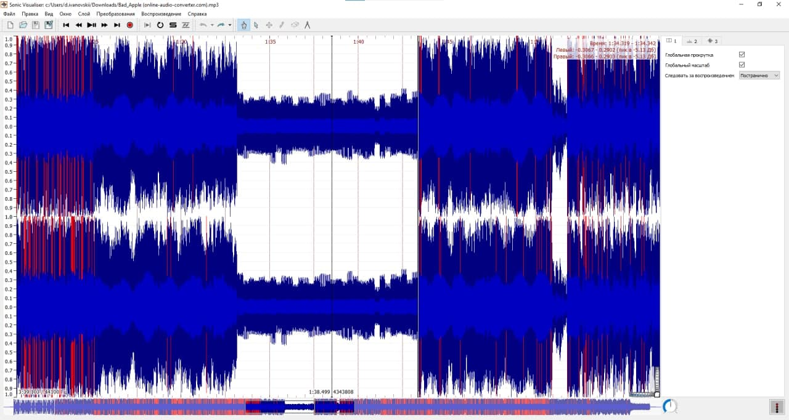
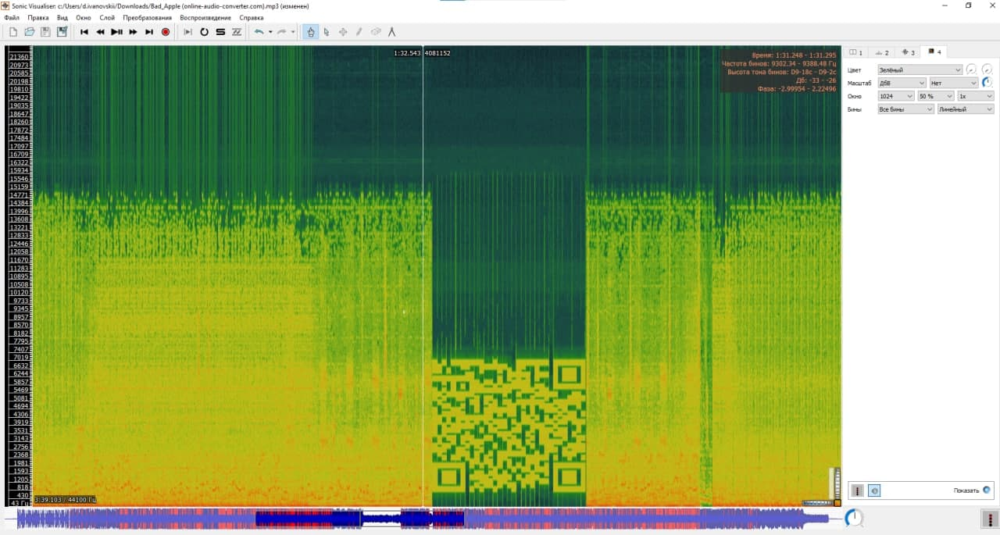

# __DragonSec SI CTF 2021__ 
## _Bad Apple_

## Information

**Category:** | **Points:** | **Writeup Author**
--- | --- | ---
MISC | 200  | soska_nerealka

**Description:** 

> Someone stumbled upon this file in a secure server. What could it mean?
>
> leaked.zip: https://github.com/DimaIvanovskiy/ctf-write-ups/blob/main/DCTF2021/BadApple/Bad_Apple.mp4

## Solution

Lets start with watching this anime opening. If we do that somewhere at 1:33 we hear some strange noises that. So that music is key to the flag. So lets extract it and download music to Sonic Vizualizer.

Now we can clearly see that something is wring with this audio. Now we should take a look at its spectrogram layer.

Oh, so its a QR code. If we use our phone to get a link it will redirect us to google search with flag.

> dctf{sp3ctr0gr4msAreCo0l}
